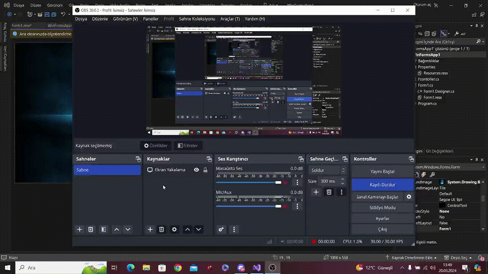

# Cs-Create-Ellipse-winforms
you can add border-radius to almost anything you want in your forms.

# Usage

Add the code to your project, after adding it, go to the form design and find the Fcontroller in the toolbox section and move it to the tool you will use (example button).

# GIF

